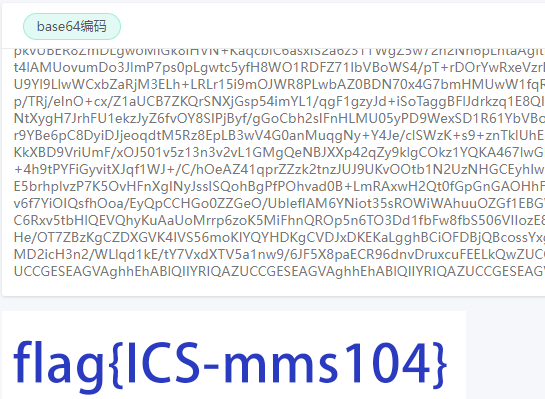
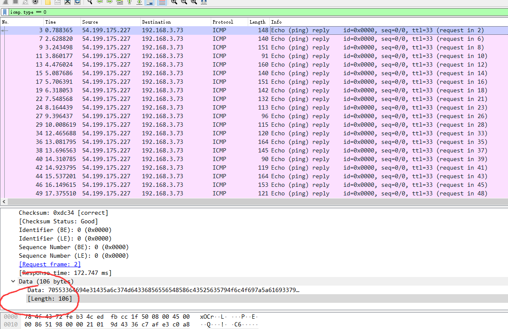
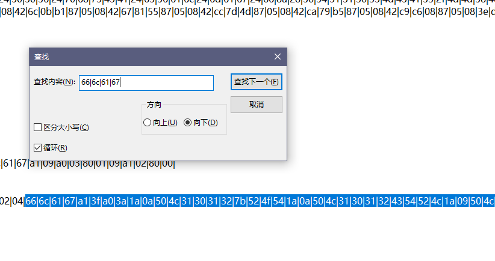
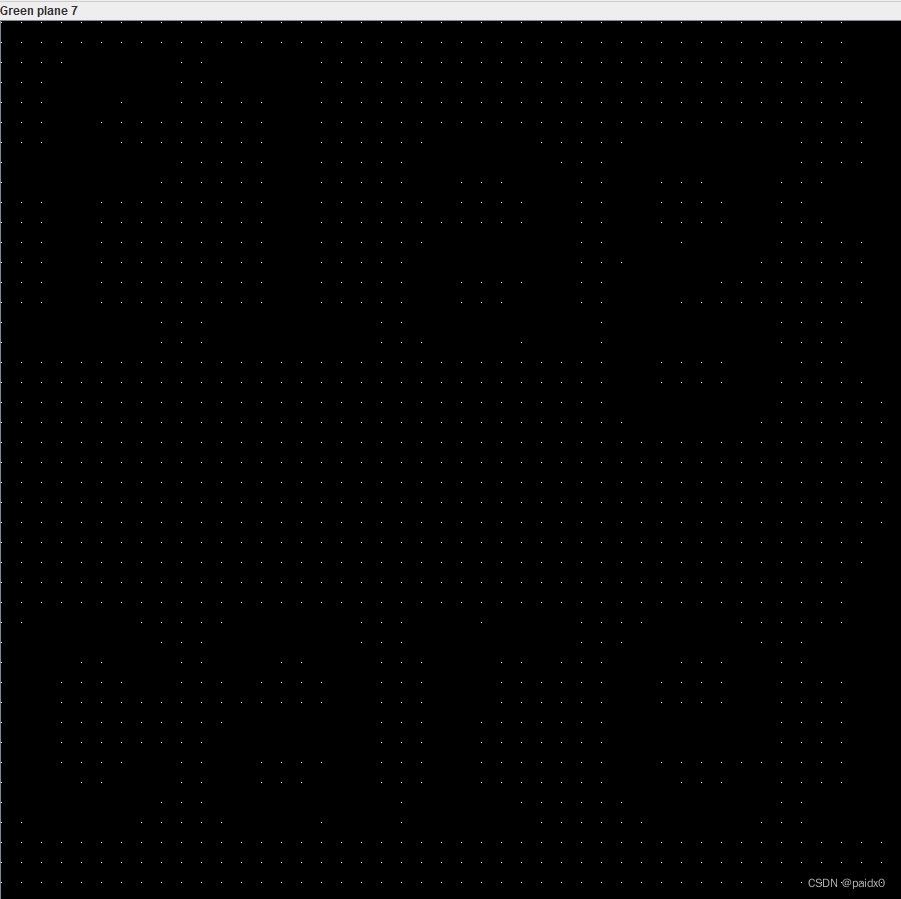
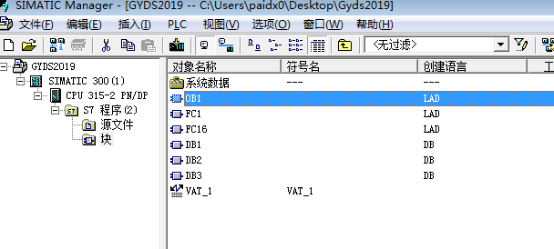
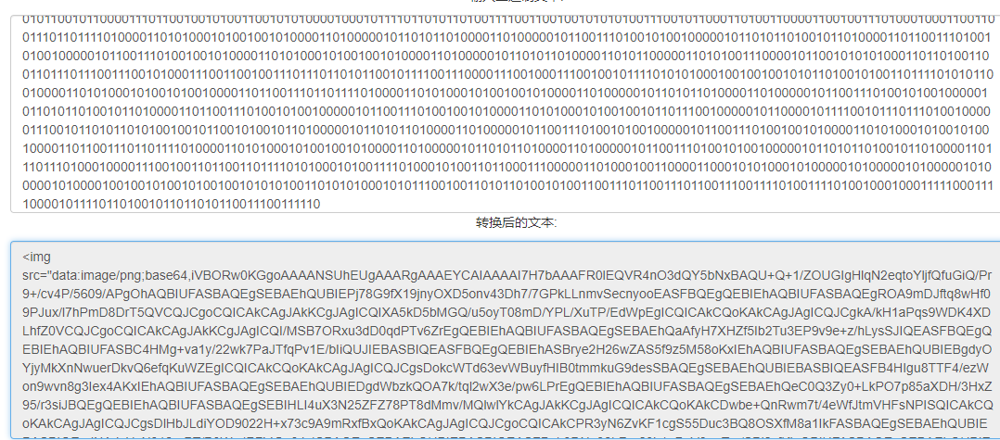
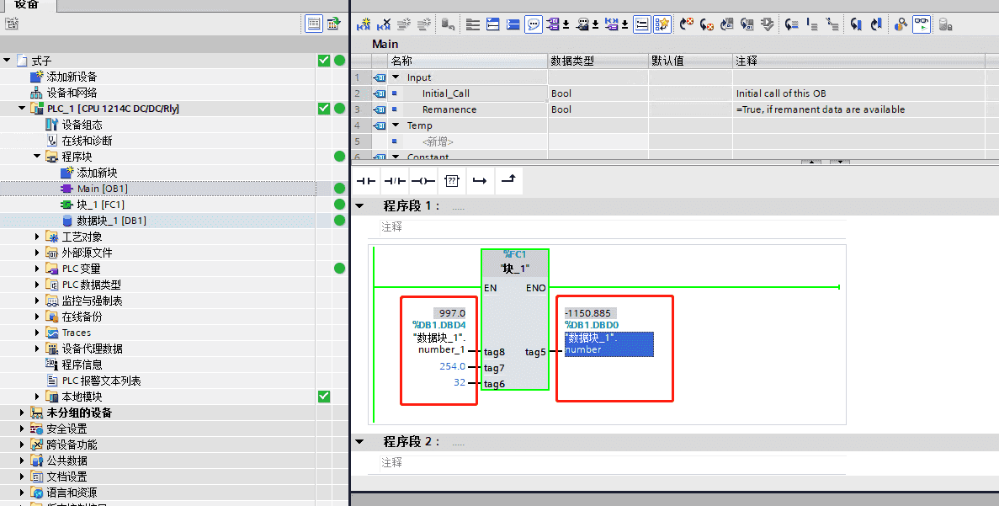

## Modbus协议

这个包长度最突出了

## MMS协议分析

## 大工UDP协议

直接 strings ，如果敏感的话一看就知道这个是什么	`666c61677b37466f4d3253746b6865507a7d`

666c 就是fl 的16进制 	`flag{7FoM2StkhePz}`

## 工控安全取证

流量全是扫端口的，过滤一下，flag是第四次扫描的数据包编号	`flag{155989}`

## 隐藏的黑客

翻流量可以发现这段，url解码发现问题

定位到这个包，追踪http流发现webshell.zip，提取出来	在1637包这里

解压缩要密码，猜测密码就在给的一堆马里，生成字典

~~~python
path = r'C:\Users\Administrator\Downloads\工控\隐藏的黑客\upload\\'
dirs = os.listdir(path)
passwd = []
for i in dirs:
    file = path+i
    with open(file)as f:
        passwd.append(str(re.findall("\[(.*)\]",f.read())).replace('[','').replace(']','').replace("'",''))
with open(path+'passwd.txt','w')as f:
    for i in passwd:
        f.write(i+'\n')
~~~

## 简单流量分析

打开流量包，很简单就是发起一个请求然后又一个响应，单独看响应包

包的长度和data的数据都不是重点，重点是data的长度，导出特定的分组流量，准备上python提取我们要的东西

~~~python
import pyshark
import base64
flag = ""
packets = pyshark.FileCapture(r'C:\Users\Administrator\Downloads\工控\简单流量分析\a.pcap')
for pack in packets:
    flag += chr(int(pack.icmp.data_len))
print(flag)
print(base64.b64decode(flag))
# 尴尬了，base64报错，不是响应包，是请求包
# b'::\\nmongodb:!:17843:0:99999:7:::\\nubuntu:$6$LhHRomTE$M7C4n84UcFLAG{xx2b8a_6mm64c_fsociety}::'
~~~

## 奇怪的文件

第一个部分缺少zip文件头，补上文件头 504B，另外两个猜测也是zip的部分，补上504B

创建个模板按顺序补回zip，part2缺少文件名，part1缺少CRC，相互补齐

然后就是解压，这个是真加密，而且密码很恶心，大写字母加数字，不只这里有后面还有更恶心的 	密码 `GyxXaq9`

最后面发现zip逆序，提取出来正序一下就是

~~~python
import binascii
with open(r'C:\Users\Administrator\Downloads\工控\奇怪的文件\data','rb')as f:
    data = binascii.hexlify(f.read())[::-1]
with open(r'C:\Users\Administrator\Downloads\工控\奇怪的文件\2.zip','wb')as f:
    for i in range(0,len(data),2):
        f.write(binascii.unhexlify(data[i:i+2][::-1]))
~~~

提取出一个python编译文件，一个密文文件，丢去反编译

~~~python
import random
import base64
import sys
def KeyGenerate():
    random.seed(10)
    keyseed = ''
    for i in range(12):
        x = random.randint(32, 127)
        keyseed += chr(x)    
    return base64.b64encode(keyseed.encode('utf-8')).decode('utf-8')
def enc(key, file):
    count = 0
    f = open(file, 'rb')
    f1 = open('encrypted', 'wb')
    for now in f:
        for nowByte in now:
            newByte = nowByte ^ ord(key[count % len(key)])
            count += 1
            f1.write(bytes([newByte]))
if __name__ == '__main__':
    key = KeyGenerate()
    enc(key, sys.argv[1])
~~~

写解密decode，很好写是一样的，随机种子固定所以key确定，然后每一位去和key做异或

~~~python
import random
import base64
def KeyGenerate():
    random.seed(10)
    keyseed = ''
    for i in range(12):
        x = random.randint(32, 127)
        keyseed += chr(x)
    return base64.b64encode(keyseed.encode('utf-8')).decode('utf-8')
def dec(key):
    count = 0
    with open('encrypted', 'rb') as enc:
        with open('decrypted', 'wb') as dec:
            for now in enc:
                for nowByte in now:
                    newByte = nowByte ^ ord(key[count % len(key)])
                    count += 1
                    dec.write(bytes([newByte]))
if __name__ == '__main__':
    key = KeyGenerate()
    dec(key)
~~~

得到一张图片，然后看不懂的操作就来了，LSB隐写是没错，这个密码是托梦来的吗	`U!lSb29`

`flag{2ceuagIha7v8mlfod9uas1d86wqer0}`

## S7COMM协议分析

这题的flag有点扯皮

s7 的包看过去也都是一个job请求，返回一个ack响应，包的长度都一样，直接长度降序看不一样的

第一个包下面感觉是16进制，得到flag，就是看着不像

## 组态软件分析

发现演示工程是没有加密的，下面的包备份是真加密

提取出来文件太多，而且也不知道这个是干嘛的，直接strings找了

## 恶意软件后门分析

我也不懂逆向，所以下面都是我拙略的一个分析，运气比较好吧

exe文件改后缀，拖到IDA，在sub_402174中发现一个ip地址

运气比较好，这个就是flag，这个ip地址往下看也可以发现是和本机有一个交互的

## 恶意软件样本分析

解压出的文件包有点多，strings先看一眼，直接找flag是没什么特别的，这个可能GitHub上有类似的项目

> 项目地址 https://github.com/MDudek-ICS/TRISIS-TRITON-HATMAN
>
> 参考文章海渊攻击 https://www.freebuf.com/articles/ics-articles/184128.html

查看wp做的，本地复现失败也记录一下	`flag{0100000001fc}`

## 另一个隐藏的黑客

题目描述是传输无线信号，所以就流量看一下，音频波形图看一下

并不是流量，Au导入原始数据，这个flag肉眼就硬看，频谱图设置瞎调也没调到一个好看的值	`flag{too simple too young}`

## 简单的APK逆向

因为不懂逆向，只会strings一个一个文件夹解包出来找

有两个文件还可以继续解包

`strings $(find . -type f) |grep -i flag`	得到 `Flag {ft-dt-src-2019-8}`

## 窃取数据的黑客

这题运气好吧，有点猜的意思，strings大法好，flag就是 `flag.txt.flag.txt`

正确做法肯定是要去看看flag.txt和flag.7z的，直接搜

提取出来解压，

## flag在哪

拿到一个有密码的压缩包，给的图片其实不难猜密码是什么，不就是这个条形码呗

中间扣掉，黑线连起来，我不会ps用画板抠出来的没扫出来，叫做剪辑的同学搞的

就这么个样子，扫出来是 `This_n0t_fl4g`

得到两张一样的图，StegSolve image combiner 图片拼接

知识盲区，我没感觉有什么不同，wp说这是==像素点==，像素隐写又长知识了

##### 像素隐写

> 项目地址 https://github.com/HFO4/HideByPixel

`a4e832b3dfb144e3b4ae5e02ab89bde`	32位不是16进制那就猜MD5	`flag{this_is_fl4g_icsc-^_^}`

## 黑客的大意

这题在buu做过，知道是个脑洞题，题目要我们找到黑客邮箱	

拿到这个图片，去GitHub上找类似项目		`gmail_user = 'gcat.is.the.shit@gmail.com'`

## 神奇的数据

给的附件看起来就像是hex流，所以直接转了，每行以 |0 为开始位置，把后面的hexstream保存下来

~~~python
import binascii
data = open(r'C:\Users\Administrator\Downloads\工控\神奇的数据\stream.txt','r').readlines()
flag = []
for line in data:
    if line[:2] == '|0':
        line = line.split(' '*3)[1].strip().split("|")
        line.pop(0)
        line.pop(len(line)-1)
        flag.append(''.join(line))
print(flag)
with open(r'C:\Users\Administrator\Downloads\工控\神奇的数据\flag','wb')as f:
    f.write(binascii.unhexlify(''.join(flag)))
~~~

不知道这个是什么的文件，但是flag确实在里面，回到 hex流找flag ，

~~~python
import binascii
src = '66|6c|61|67|a1|3f|a0|3a|1a|0a|50|4c|31|30|31|32|7b|52|4f|54|1a|0a|50|4c|31|30|31|32|43|54|52|4c|1a|09|50|4c|31|30|31|32|4c|44|30|1a|0a|50|4c|31|30|31|32|4d|45|41|53|1a|09|50|4c|31|30|31|32|52|43|7d|81|01|00'
src = ''.join(src.split('|'))
flag = str(binascii.unhexlify(src))
print(flag)
flag = str(flag).replace('PL1012','').replace(r"\x1a",'').replace(r'\n','')
print(flag)
# flag{ROTCTRLLD0MEASRC}
~~~

## 异常的S7数据

全是S7 的协议流量，流量太多直接strings找一下先，57万里找1条异常流量，麻了

基本就是一个请求一个应答，过滤一下，看请求包

试了下找到的这个，并不是flag

发现这些包并没有什么明显的差别，包 Length都是113，Data Length都是14，data Length都是10

唯一的不同就是 Data值一直在变，而且只变 ffff 后面的，再过滤一下不是 ffff 的，	

`!(s7comm.resp.data[0:2] == ff:ff) and s7comm.header.rosctr == 1`

flag{FFAD28A0CE69DB34751F}

## 图片的奥秘

放大了看，不难看出图片后面是藏了点阵的

stegsolve 换个通道看图片，确定是藏了点阵

每20个点有一个信息点，将其余部分像素置于红色

~~~python
from PIL import Image
img = Image.open(r'.\工控\图片的奥秘\under_your_nose.jpg')
img = img.convert('RGB')
x, y = img.size
for i in range(x):
    for j in range(y):
        color = img.getpixel((i, j))
        if (i % 20 != 0) or (j % 20 != 0):
            color = (255, 0, 0)
        img.putpixel((i, j), color)
img.save(r'.\工控\图片的奥秘\a.jpg')
~~~

绿色通道下发现flag

## TCP-urgent-pointer

看评论提示，和题目标题有关

都是0，所以就找不是0的导出特定分租出来

~~~python
import pyshark
import base64
packets = pyshark.FileCapture(r'C:\Users\Administrator\Downloads\工控\TCP-urgent-pointer\a.pcapng')
flag = ""
for pack in packets:
    flag += chr(int(pack.tcp.urgent_pointer))
print(flag)
print(base64.b64decode(flag))
# ZmxhZ3tjaDIycjVfZjByX3kwdX0=
# b'flag{ch22r5_f0r_y0u}'
~~~

## 工业梯形图分析一

s7p文件，是西门子的PLC项目文件

##### 西门子s7-300

> 工控软件下载地址 https://bbs.jcpeixun.com/thread-11948-1-1.html
>
> s7-300下载地址 https://www.cnblogs.com/legion/p/9562717.html
>

专门开了个win7 的虚拟机装乱七八糟的西门子工控软件

OB 是主程序块，FC 是功能块，DB 是数据块

OB 里把 PIW 改成题目给的值，然后启动仿真软件

仿真软件要 stop才可以下载，然后运行，连接PLC，在线监听

flag 为DB2.DBD0的值，也就是 `flag{37091.9}`

## 工业梯形图分析二

同上，DB8.DBX0.0要为1通路，就需要DB7.DBX0.0为1通路，所以右键修改值为1

找DB20.DBW0的值

flag{C8}

## 虚拟PLC

这个就是 	flag{myfiletypeisplcsim}

## 破解加密数据

##### rsa-rabin

> 特征：e = 2
>
> https://www.jianshu.com/p/c18ee34058ed

~~~python 
import gmpy2
import libnum

c = 109930883401687215730636522935643539707
p = 10848126018911527523
q = 13691382465774455051
n = p*q
u = pow(c,(p+1)/4,p)
v = pow(c,(q+1)/4,q)
#   sp+tq=1
s = gmpy2.invert(p,q)   # (p^-1) mod q
t = gmpy2.invert(q,p)   # (q^-1) mod p
x = (t*q*u+s*p*v)%n
y = (t*q*u-s*p*v)%n

print libnum.n2s(x%n)
print libnum.n2s((-x)%n)
print libnum.n2s(y%n)
print libnum.n2s((-y)%n)
~~~

## 所见非真

## 常见的编码转换

额，这个一下忘记怎么做了，这个压缩包不能爆破到，而且也没全部识别到很奇怪

也不是伪加密，是真加密，后面找到是crc爆破

##### crc爆破

压缩包密码 forum_91ctf_com_66，二进制转字符

## ICMP协议分析

题目叫ICMP，所以直接找ICMP就行，别的看一下就行，大部分都是杀毒软件的流量

ICMP流量包有5个，data的数据就是flag

## 流量隐写

改后缀Rar，提取出来是个流量包，改后缀pcap

tcp会话只有9个，而且一些也都不用去看

发现了个包含flag.txt的Rar，和一段AES加密的过程

~~~python
from Crypto import Random
from Crypto.Cipher import AES
import sys
import base64
IV = 'QWERTYUIOPASDFGH'
def decrypt(encrypted):
  aes = AES.new(IV, AES.MODE_CBC, IV)
  return aes.decrypt(encrypted)
def encrypt(message):
  length = 16
  count = len(message)
  padding = length - (count % length)
  message = message + '\0' * padding
  aes = AES.new(IV, AES.MODE_CBC, IV)
  return aes.encrypt(message)
str = 'this is a test'
example = encrypt(str)
print(decrypt(example))
~~~

## 隐藏的信息

tcp流2发现图片

## 工业现场应急响应

## Modbus协议流量分析

## 工控业务流量分析

流量有点多，直接看工控协议的流量，s7协议的流量基本可以排除，数据包的长度基本一样，一个请求一个响应

modbus协议同样过滤掉大部分一样的东西，然后发现 read coils 和 write multiple coils 都只有一次，大部分是 read holding registers

导出这串 bit流

~~~python
# import pyshark
#
# pack = pyshark.FileCapture(r'C:\Users\Administrator\Downloads\工控\工控业务流量分析\a.pcapng')
#
# flag = ""
# for i in pack:
#     print(i.modbus)
src = """
...............
"""
# 010000110111100101100010011001010111001001010111011011110111001001101100011001000100001101110101011100000100001101000101010101000100001100110010001100000011000100111000
src = src.replace('\t','').split('\n')
flag = ""
for i in src:
    flag += i.split(' : ')[1]
print(flag)
print(len(flag))
result = ""
for i in range(0,len(flag),8):
    result += chr(int(flag[i:i+8],2))
    print(result)
# CyberWorldCupCETC2018
~~~

## 恶意文件溯源

zip解压得到一个docx，打开提示文档损坏，直接解包找flag

## 协议精准定位分析

主要看tcp协议，只有14个tcp会话，直接追踪TCP流看看

看看原始数据什么样，像是某种协议，然后文档不是还给了个pdf文档吗，英文的是看不懂了，找个中文的快速看一下重点

> 中文文档 https://max.book118.com/html/2019/0409/6235032035002022.shtm

最下面的数据引起注意，这不就是flag	666c6167

懂了，这部分才是数据传输的部分，其他部分主要是请求和响应过程

~~~python
src = """
...............
"""
flag = ""
src = src.split('\n')
for i in src:
    flag += chr(int(i[-8:-6],16))
    print(flag[::-1])
# flag{c9365021853da240f9760531a79cbcf}
~~~

## 泄露的信号

这题前几天在攻防世界misc上做过类似的

题目描述是工控设备的无线信号，我们知道这种无线信号无非就是某种频率的波嘛，所以直接Au看了

这玩意看傻了，也看不全是个啥	flag{1cbnz723x81il1812ss2}

## 工控大楼的道闸怎么坏了

Au打开就这么个样子，其实看到这个就想到了那个遥控信号，之前在buu做到过，就电单车开锁或者别的什么开锁前发出的一段信号

直接看其中一段吧，都是一样的

##### PT2242信号

> 前面4bit表示同步码，中间的20bit表示地址码，后面的4bit表示功能码，最后一位是停止码

假设短的是0，长的是1，按照信号也就是	0	10101011001011001000 0001 0，所以	flag{ab2c81}

~~~python
src = "101010110010110010000001"
flag = ""
for ii in range(0,len(src),4):
    flag += hex(int(src[ii:ii+4],2))[2:]
    print(flag)
# ab2c81
~~~

## 工业物联网智能网关数据分析

注意到有MQTT协议的流量包，过滤出来看看

##### MQTT协议

> MQTT是一个基于客户端-服务器的消息发布/订阅传输协议。MQTT协议是轻量、简单、开放和易于实现的，这些特点使它适用范围非常广泛。在很多情况下，包括受限的环境中，如：机器与机器（M2M）通信和物联网（IoT）。其在，通过卫星链路通信传感器、偶尔拨号的医疗设备、智能家居、及一些小型化设备中已广泛使用

d 包发现一个密码，先留着	pass_1s_ea4y

这里面肯定藏着一个压缩包，所以按照flag的顺序查看

得到半截图片，猜测改了宽高，改回来 260 * 260，得到一部分flag

发现 LSB隐写，是个图片，分离出来

拼接起来，扫码得到 flag{21png_LSB_is_easy}

## 被篡改的数据

过滤出 write var 的data数据，66看着像 flag

~~~python
import pyshark
packets = pyshark.FileCapture(r'C:\Users\Administrator\Downloads\工控\被篡改的数据\a.pcapng')
flag = ""
for pack in packets:
    flag += chr(int(pack.s7comm.resp_data,16))
print(flag)
# flag{931377ad4a}
~~~

## 异常的工程文件

## 病毒文件恢复

直接丢360勒索病毒在线恢复文件

> https://lesuobingdu.360.cn/

## 简单Modbus协议分析

## 工控现场的恶意扫描

## 注册表分析

直接搜 NetworkList\Profiles 就行了	flag{OPPOReno}

## 工控组态分析

s7-200打开就行，算一下值	flag{VD200_20.21_VD300_19.821}

##### 西门子s7-200

## 梯形图分析1

博途打开改下数据就行了	flag{1.216667}

##### 博途

## S7协议恶意攻击分析

直接来看s7协议，先是开始通信的信号，然后后面都是正常工作，所以过滤掉再看

`!(s7comm.param.userdata.reqres1 == 0x12) and !(s7comm.param.userdata.reqres1 == 0x11) and s7comm`

可以发现确实有多次的 stop行为，而且是从 1321包开始，所以根据要求就是	flag{3201414d}

## 上位机通讯异常分析

flag{010400100100}

wireshark找也很快，题目说是存在异常但是系统没报警，查看 Ack_data 都是成功，所以过滤一下不是成功的

`!(s7comm.data.returncode == 0xff) and s7comm.header.rosctr == 3`

## 梯形图2

同样是博途改个数据就行	flag{-1150.885}

## Fins协议通讯

底下发现3DES，还要继续找秘钥

一顿找好家伙，秘钥就在压缩包里，早该注意到这是个Rar，注释也可以藏东西的

## 隐藏的工程

发现是F5隐写，密码猜测是 ICS，解出一个蓝奏的链接

##### Kingview 组态王

工艺流程图上没发现什么，一顿乱翻找到了

这里我网上找的星号密码查看的工具都不能查看	直接放flag	flag{fAx9AKoqNgv3dfHg}

## 损坏的风机

根据描述，超过2000转每分钟才会出现故障，然后要我们找到第一次出现故障时位置，flag就是data的HEX值

这个也很好找，科来直接看data的解码字段

~~~cmd
0x96	150
0xb4	180
0xc8	200
0x118	280
0xbb8	3000
# 可以发现发送的转速指令数据是越来越快,最后是来到3000转每分钟,此时是第一次出现故障的位置
# flag{4d0000000006010600000bb8}
~~~

## 简单的梯形图

简单分析一下，可以知道V1、V3、V6、V8、V7、V4，这些都是固定的，然后V5+V2=V7，V5的值也能确定，LOGV3=V5，所以V2也就知道了

V2=V7-V5，%IW4 * 3.09 =V2，所以 %IW4也可以推出来	flag{21004}

## 隐藏的工艺

foremost分离出压缩包，有密码，真加密，爆破得到密码 FC00

又是个工控项目文件，发现flag图片	flag{qwerasd}

## 被加密的系统日志

可能是被勒索病毒所加密，使用BDGandCrabDecryptTool进行破解

破解拿到一个日志文件	flag{2021_gkand5_1v}

## 控制器数据备份失败

别的都是0100，只有这个是 0010	flag{154690010}

## 异常的Fins协议分析

flag{7717}

## 异常的IEC104分析

查看IEC_104协议就可以发现规律

flag{welcome}

## 工控梯形图分析1

#### auto think

==有个要注意的就是这里比赛时给了个hint，就是 V9=30866，如果没有这个V9的值，反向去推V10、V9太难了，可能情况太多了==

知道V9和V6，那V11就是算一下的事，注意下V14在这里是正值的情况，flag是V11+V13	flag{11.2467985302}

## 异常的协议分析

3403 发现一串加密字符串

## 工控梯形图分析2

工控组态分析原题